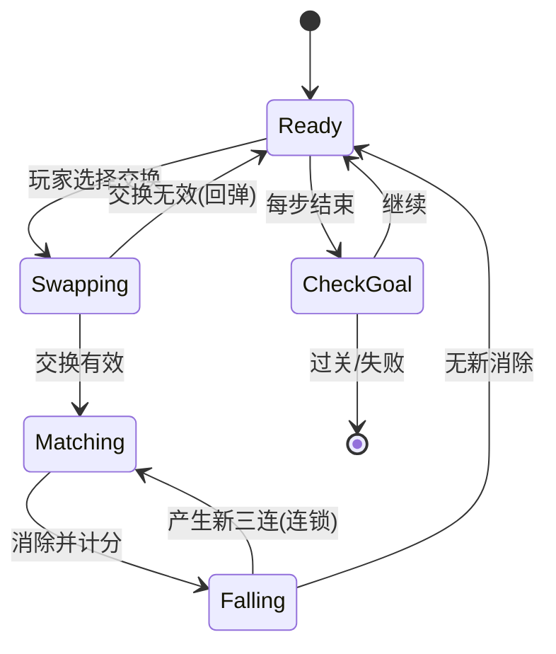

# 三消类游戏 — 开发计划文档

## 一、游戏概述

### 1.1 定位与目标
- **类型**：休闲三消（Match-3）
- **平台**：Cocos Creator 3.x（当前 3.8.8），优先 Web / 小游戏
- **目标**：单局 2–5 分钟，易上手、有连消与策略深度

### 1.2 核心玩法简述
玩家在网格中交换相邻的两个元素，使横或竖方向连续出现 **3 个及以上相同类型** 即消除；消除后上方元素下落、新元素补充，形成连消与连锁反应，积累分数与达成关卡目标。

---

## 二、核心规则与机制

### 2.1 基础规则
| 项目 | 说明 |
|------|------|
| 网格 | 如 8×8 或 9×9，可配置 |
| 元素种类 | 5–6 种基础宝石/图标，可扩展 |
| 交换 | 仅允许相邻（上下左右）两格互换 |
| 有效交换 | 交换后至少一方能形成 3 连即允许，否则回弹 |

### 2.2 消除规则
- **三连**：横或竖 3 个同色 → 消除，基础分
- **四连 / L/T 型**：可产出「直线消除」特殊块（横线/竖线）
- **五连 / 十字**：可产出「炸弹」或「范围消除」特殊块
- **特殊块使用**：点击或与普通块交换后触发范围/整行整列消除

### 2.3 连消与连锁
- 单次操作内多次消除：连消倍数（如 1x → 2x → 3x）
- 下落产生新消除：计为连锁，可额外加分或特效区分

### 2.4 关卡目标（可选类型）
- **目标分数**：规定步数内达到分数
- **收集目标**：消除指定颜色或指定数量
- **障碍物**：冰块、锁链、层数块，需多次消除清除
- **限步**：每关固定步数，用尽即失败

---

## 三、技术架构（Cocos Creator）

### 3.1 目录与场景规划

```
assets/
├── scenes/
│   ├── Boot.scene          # 启动/预加载
│   ├── Home.scene          # 主菜单、选关
│   └── Game.scene          # 游戏主场景
├── prefabs/
│   ├── GridCell.prefab     # 单格
│   ├── Gem.prefab          # 基础宝石（多种变体或单 prefab+图集）
│   ├── SpecialGem.prefab   # 特殊块（横线/竖线/炸弹等）
│   └── ParticleMatch.prefab # 消除特效
├── scripts/
│   ├── game/
│   │   ├── GameController.ts    # 对局总控
│   │   ├── GridManager.ts      # 网格生成与格子管理
│   │   ├── MatchLogic.ts       # 检测三消、L/T、十字
│   │   ├── SwapController.ts   # 拖拽/点击交换与回弹
│   │   ├── FallManager.ts      # 下落与补充
│   │   └── ComboManager.ts     # 连消与连锁
│   ├── ui/
│   │   ├── HomeUI.ts
│   │   ├── GameHUD.ts          # 分数、步数、目标
│   │   └── ResultPanel.ts      # 结算
│   └── data/
│       ├── LevelConfig.ts      # 关卡配置
│       └── GameConfig.ts       # 全局参数
├── resources/              # 动态加载资源
│   ├── gems/               # 宝石图集或单图
│   └── levels/              # 关卡 JSON（可选）
└── ...
```

### 3.2 场景层级建议（Game.scene）

```
Game (Canvas)
├── UI (Widget 全屏)
│   ├── TopBar (分数、步数、目标)
│   └── ResultPanel (隐藏，结算时显示)
├── GameBoard (居中)
│   └── Grid (节点池：Gem / GridCell)
└── Effects (挂粒子/动画，可选)
```

### 3.3 核心类职责

| 模块 | 职责 |
|------|------|
| **GameController** | 进入/退出对局、加载关卡配置、协调各 Manager、判断过关/失败 |
| **GridManager** | 按配置生成网格与初始宝石、维护二维数组、提供「某格置空/填充」接口 |
| **MatchLogic** | 输入网格状态，返回所有可消除组合（三连、四连、L/T、五连）；判断是否存在合法移动 |
| **SwapController** | 处理拖拽或两次点击，校验交换是否产生消除；若无效则播放回弹动画 |
| **FallManager** | 消除后按列下落、顶部补充新宝石、再次调用 MatchLogic 检测连锁 |
| **ComboManager** | 统计当次操作的连消次数与连锁，计算倍数与额外分 |

---

## 四、流程与状态

### 4.1 对局流程



### 4.2 单步操作细流程
1. 玩家选择两个相邻格子 → **SwapController** 执行交换动画。
2. **MatchLogic** 检测：有 3+ 连则进入消除阶段；否则回弹并回到 Ready。
3. **消除**：收集所有匹配块（含特殊块生成）→ 播放消除动画 → 从 **GridManager** 移除。
4. **FallManager**：下落 + 顶部补充，填满空位。
5. 再次 **MatchLogic**：若仍有匹配则回到步骤 3（连锁）；否则 **ComboManager** 结算本步连消/连锁。
6. 更新步数、分数、目标 → **GameController** 判断过关/失败或进入下一步。

---

## 五、数据结构建议

### 5.1 关卡配置示例（LevelConfig / JSON）

```ts
interface LevelConfig {
  level: number;
  row: number;
  col: number;
  maxMoves: number;
  goalType: 'score' | 'collect' | 'clear';
  goalValue: number;           // 目标分数 / 收集数量等
  gemTypes: number[];           // 本关出现的宝石类型
  obstacles?: { type: string; positions: [number, number][] };
}
```

### 5.2 网格与宝石
- 用二维数组 `GemType[][]` 或 `Node[][]` 表示逻辑网格，与 **GridManager** 中节点一一对应。
- 每个格子可扩展：`{ gemType, specialType?, obstacle? }` 便于后续做障碍与特殊块。

---

## 六、UI 与表现

### 6.1 主菜单（Home）
- 开始游戏、选关（列表或地图）、设置（音效/音乐）、简单说明。

### 6.2 对局 HUD（GameHUD）
- 分数、剩余步数、当前关卡目标（如「收集 20 个红色」）与进度条/数字。
- 暂停按钮 → 弹窗：继续 / 重开 / 返回主菜单。

### 6.3 结算（ResultPanel）
- 过关：星级、分数、奖励；下一关 / 重玩 / 返回。
- 失败：提示、重试 / 返回。

### 6.4 表现与体验
- 交换、消除、下落、连消有明确动画与音效。
- 连消/连锁时简短文字或特效（如 "Combo x2"）。
- 特殊块生成与触发有单独特效，便于识别。

---

## 七、开发阶段建议

| 阶段 | 内容 | 产出 |
|------|------|------|
| **Phase 1** | 基础框架与单局循环 | 固定 8×8 网格、5 种宝石、仅三连消除、步数限制、基础分数 |
| **Phase 2** | 交互与反馈 | 拖拽/点击交换、回弹、消除与下落动画、基础音效 |
| **Phase 3** | 连消与特殊块 | 四连/五连检测、横线/竖线/炸弹、连消倍数与连锁 |
| **Phase 4** | 关卡与目标 | 多关卡配置、目标分数/收集/障碍、选关与存档 |
| **Phase 5** | 打磨 | UI 美化、粒子与节奏优化、简单教学与无障碍设计 |

---

## 八、风险与注意点

- **性能**：大量节点时使用对象池（NodePool）复用 Gem/特效，避免频繁创建销毁。
- **随机性**：补充新宝石时避免「一补就立刻又三连」可做简单规则（如禁止顶部 2 格直接成三连）。
- **可玩性**：若某关无合法移动，可在开局或每 N 步做一次「洗牌」或自动执行一次有效交换。

---

本文档可作为《三消》在 Cocos Creator 中的设计与实现总纲，按 Phase 1 → 5 逐步实现即可落地为可玩版本。
